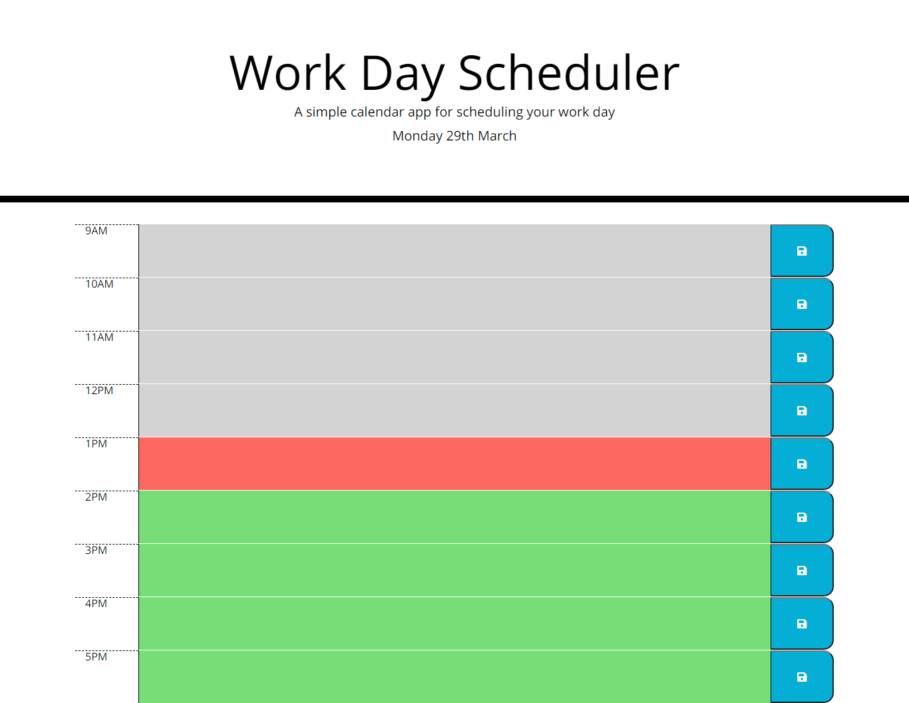

<h1>Work Day Scheduler</h1>

<h2> Table of Contents </h2>

- [Project link](#project-link)
- [About the Project](#about-the-project)
- [Screenshots](#screenshots)
  - [Full screen image](#full-screen-image)
  - [Image showing no errors in console](#image-showing-no-errors-in-console)
  - [Image showing local storage](#image-showing-local-storage)

## Project link

Click [here](https://natasha-mann.github.io/work-day-scheduler/) to view the deployed application.

## About the Project

In this project I had to use jQuery and moment.js to add functionality to a day planner website. The requirements as follows:

- On load of the page the current date should be displayed in the header.
- Each hour of the planner should be colour coded to show which hours are in the past, which is the current hour and which are in the future.
- The user can add text to each hour.
- The input text can be saved into local storage.
- When the page is refreshed, the stored text is still visible on the page.

## Screenshots

### Full screen image

### Image showing no errors in console

### Image showing local storage

